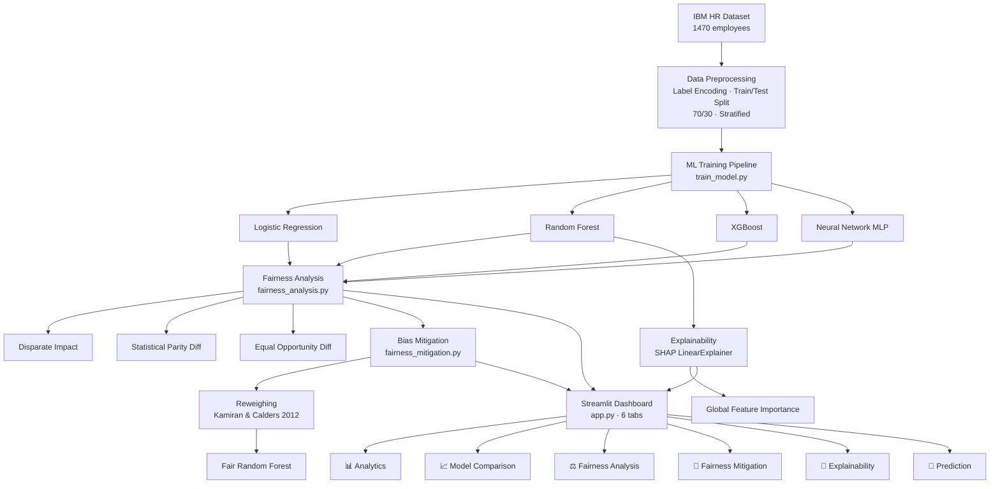

# Fairness-Aware Machine Learning for Employee Attrition Prediction: An Empirical Study

> **Research Question:** How do different machine learning models compare in predictive performance and algorithmic fairness for employee attrition prediction, and can bias mitigation reduce gender disparity without significant accuracy loss?

[](https://responsible-ai-attrition-dashboard.streamlit.app/)


---

## Research Contributions

This project makes four concrete research contributions:

1. **Comparative ML evaluation** — Four models (Logistic Regression, Random Forest, XGBoost, Neural Network) evaluated with Accuracy, F1, and AUC on an imbalanced HR dataset
2. **Cross-model fairness auditing** — Disparate Impact, Statistical Parity Difference, and Equal Opportunity Difference computed per model, revealing a measurable accuracy-fairness tradeoff
3. **Bias mitigation experiment** — Reweighing (Kamiran & Calders, 2012) applied to quantify fairness improvement vs accuracy cost
4. **Explainability analysis** — SHAP-based feature importance connecting model behaviour to fairness outcomes

---

## Key Findings

| Model | Accuracy | F1 Score | AUC | Disparate Impact | Verdict |
|---|---|---|---|---|---|
| Logistic Regression | 0.839 | 0.000 | 0.636 | — | Predicts no attrition (accuracy paradox) |
| Neural Network (MLP) | 0.814 | 0.163 | 0.615 | 1.495 | ⚠️ Fairness risk |
| Random Forest | 0.807 | 0.175 | 0.583 | 1.252 | ⚠️ Fairness risk |
| XGBoost | 0.791 | 0.193 | 0.565 | 1.274 | ⚠️ Fairness risk |

**Finding 1 — Accuracy paradox:** Logistic Regression scores highest accuracy (83.9%) but F1=0, meaning it never predicts attrition. A model can appear accurate by always predicting the majority class in a 5.2:1 imbalanced dataset.

**Finding 2 — Accuracy-fairness tradeoff:** Models that actually predict attrition all show Disparate Impact > 1.25 (over-predicting attrition for females relative to males). Correlation between AUC and fairness deviation = 0.90.

**Finding 3 — Mitigation result:** Reweighing reduced accuracy cost to only Δ=−0.009 but did not improve Disparate Impact, suggesting gender disparity is driven by feature-level correlations (income, job level) rather than representation imbalance — motivating future feature-level debiasing work.

---

## System Architecture



---

## Project Structure

```
responsible-ai-attrition-dashboard/
├── app.py                        # Streamlit dashboard (6 tabs)
├── train_model.py                # Multi-model training pipeline
├── fairness_analysis.py          # Per-model fairness evaluation
├── fairness_mitigation.py        # Reweighing bias mitigation
├── requirements.txt
├── data/
│   └── WA_Fn-UseC_-HR-Employee-Attrition.csv
├── models/                       # Generated — one .pkl per model
│   ├── logistic_regression.pkl
│   ├── random_forest.pkl
│   ├── xgboost.pkl
│   ├── neural_network_mlp.pkl
│   └── fair_random_forest.pkl
└── results/                      # Generated — CSVs + plots
    ├── model_comparison.csv
    ├── fairness_comparison.csv
    ├── fairness_comparison_plot.png
    ├── mitigation_comparison.csv
    └── mitigation_comparison_plot.png
```

---

## Dataset

**IBM HR Analytics Employee Attrition Dataset** — 1,470 employees, 35 features.

Features used: Age · Gender · Education · Job Level · Monthly Income · Years at Company

Key characteristic: **5.2:1 class imbalance** (No:Yes attrition) — directly impacts model behaviour and is central to the accuracy paradox finding.

Source: [Kaggle — IBM HR Analytics](https://www.kaggle.com/datasets/pavansubhasht/ibm-hr-analytics-attrition-dataset)

---

## Fairness Metrics

| Metric | Formula | Ideal | Threshold |
|---|---|---|---|
| Disparate Impact (DI) | P(ŷ=1\|female) / P(ŷ=1\|male) | 1.0 | 0.8 – 1.25 (EEOC 80% rule) |
| Statistical Parity Diff (SPD) | P(ŷ=1\|female) − P(ŷ=1\|male) | 0.0 | \|SPD\| < 0.05 |
| Equal Opportunity Diff (EOD) | TPR(female) − TPR(male) | 0.0 | \|EOD\| < 0.05 |

---

## How to Run Locally

```bash
# 1. Clone
git clone https://github.com/asthasingh0660/responsible-ai-attrition-dashboard.git
cd responsible-ai-attrition-dashboard

# 2. Set up environment
python -m venv venv
venv\Scripts\activate        # Windows
# source venv/bin/activate   # Mac/Linux

# 3. Install dependencies
pip install -r requirements.txt
pip install xgboost

# 4. Run in order
python train_model.py           # trains all 4 models
python fairness_analysis.py     # fairness evaluation per model
python fairness_mitigation.py   # bias mitigation experiment

# 5. Launch dashboard
streamlit run app.py
```

---

## Responsible AI Design

This system is explicitly designed as a **decision-support tool**, not an automated decision-maker.

- **Human-in-the-loop** — every prediction tab includes clear disclaimers
- **Fairness-first evaluation** — fairness metrics computed alongside performance metrics, not as an afterthought
- **Honest mitigation reporting** — mitigation results reported truthfully including cases where improvement was not achieved
- **Explainability** — SHAP values connect model behaviour to human-interpretable features
- **Confidence-aware predictions** — low-confidence outputs flagged explicitly

---

## Technologies

Python · Scikit-learn · XGBoost · SHAP · Streamlit · Pandas · NumPy · Matplotlib · Seaborn

---

## Author

**Astha Singh**

---

## Disclaimer

This project is intended for educational and research purposes only. Predictions and insights should not be used as the sole basis for real-world HR decisions.